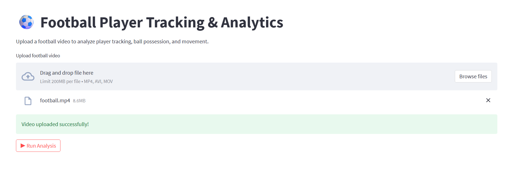

# ⚽ Football Player Tracking & Analytics using YOLO

## 📌 Project Overview
This project presents an **end-to-end football player tracking and analytics pipeline** built using **deep learning and computer vision techniques**.  
The system detects and tracks players, goalkeepers, referees, and the ball from football match videos and performs **movement analysis, speed estimation, distance calculation, team assignment, and camera motion compensation**.

The project is designed for **sports analytics, research, and performance analysis**, and demonstrates how modern object detection models like **YOLO** can be integrated into a complete analytical pipeline.

---

## 🎯 Objectives
- Detect football players, ball, referees, and goalkeepers from match videos
- Track each player consistently across frames
- Assign players to teams using color-based analysis
- Estimate **player speed and total distance covered**
- Compensate for **camera movement**
- Generate analytical visual outputs from raw video input

---

## 🧠 Model & Techniques Used

### 🔹 Object Detection
- **YOLO (You Only Look Once)** deep learning model
- Custom-trained weights (`best.pt`)
- Detects:
  - Players
  - Goalkeepers
  - Ball
  - Referees

### 🔹 Tracking
- Multi-object tracking based on bounding box association
- Frame-to-frame identity consistency

### 🔹 Team Assignment
- Jersey color extraction
- Color clustering and comparison
- Automatic team classification

### 🔹 Speed & Distance Estimation
- Player displacement across frames
- Real-world distance estimation using perspective transformation
- Per-player speed and distance metrics

### 🔹 Camera Motion Compensation
- Camera movement estimation
- View transformation to stabilize motion
- Accurate spatial measurements

---

## 🏗️ Project Structure

```text
Football_Player_Tracking_Project/
│
├── app.py                         # Main execution pipeline
├── main.py                         # Main execution pipeline
├── yolo_inference.py               # YOLO inference module
│
├── camera_movement_estimator/      # Camera motion estimation
├── trackers/                       # Object detection & tracking logic
├── team_assigner/                  # Team classification
├── speed_and_distance_estimator/   # Speed & distance calculation
├── player_ball_assigner/           # Ball possession logic
├── view_transformer/               # Perspective / view transformation
├── utils/                          # Helper utility functions
│
├── models/
│   └── best.pt                     # Trained YOLO model
│
├── input_videos/                   # Input football videos
├── output_videos/                  # Output results (annotated videos)
│
├── development_and_analysis/       # Analysis notebooks
├── training/                       # YOLO training notebook
│
├── README.md                       # Project documentation
└── .gitignore                      # Git ignore rules
```

## 📥 Inputs Used
The system was tested using:
1. **Football match video downloaded from YouTube**
2. Sample football gameplay video

Input videos are placed inside:

## 🎥 Demo Input Video
[](input_videos/input_sample.mp4)

---

## 📤 Outputs Generated
The pipeline generates:
- Annotated video frames
- Player tracking visualizations
- Cropped player images
- Analytical screenshots

Stored in:

## 🎥 Demo Output Video
📂 **output_videos/**  
▶️ [Click to watch demo output](output_videos/output_sample.avi)


---

## 🌐 Interactive Web Demo (Streamlit)

This project includes an optional **Streamlit-based web interface** that allows users to:

- Upload a football match video
- Run the complete player tracking and analytics pipeline
- Visualize player tracking, team assignment, and ball possession
- Preview and download the processed output video

### 🖥️ UI Preview

Below is a screenshot and vide of the Streamlit user interface:




> 📁 The screenshot is stored in the `demo/` directory of this repository.

### ▶️ Run the Streamlit App Locally

To launch the Streamlit web application on your local machine:

```bash
streamlit run app.py


## ▶️ How to Run the Project

### 1️⃣ Install Dependencies
```bash
pip install ultralytics supervision opencv-python torch

### 2️⃣ Place Input Video
input_videos/football.mp4

### 3️⃣ Run the Pipeline
python main.py
```
## 🚀 Applications

Sports analytics & performance evaluation

Player movement analysis

Match strategy research

Computer vision academic projects

AI-based sports technology demos

### 👤 Author
Adnan Faisal
📧 Email: ajfaisal1208023@gmail.com

### 📜 License

This project is intended for educational and research purposes.
